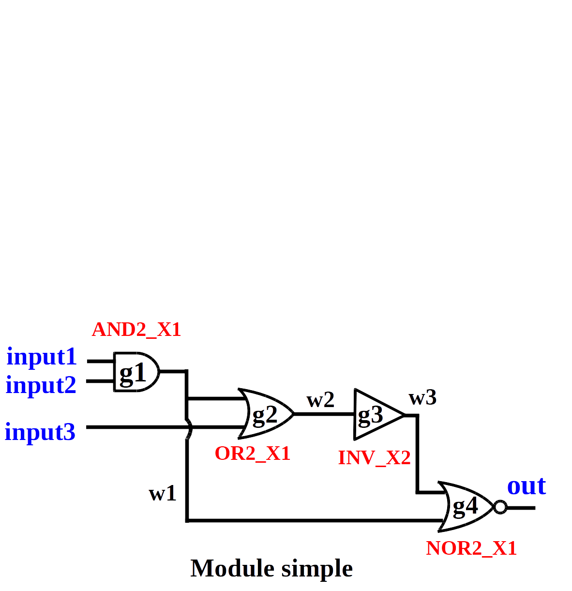

# Parser-Verilog 

A Standalone Structural Verilog Parser

# Get Started with Parser-Verilog 

A [Verilog] is a programming language that is used to describe a 
digital circuit. Below is a circuit written in Verilog.

 

```Verilog 
module simple (input1, input2, input3, out);

// primary inputs
input input1, input2, input3;

// primary output
output out; 

wire out;

// wires
wire w1;
wire w2;
wire w3;

// module instances
AND2_X1 g1 (.a(input1), .b(input2), .o(w1));
OR2_X1 g2  (.a(input3), .b(w1), .o(w2));
INV_X2 g3  (.a(w2), .o(w3));
NOR2_X1 g4 (.a(w1), .b(w3), .o(out));

endmodule
```

The following example demonstrates how to use Parser-Verilog to parse a Verilog file.


```cpp
#include <iostream>

#include "verilog_driver.hpp"   // The only include you need

// Define your own parser by inheriting the ParserVerilogInterface
struct MyVerilogParser : public verilog::ParserVerilogInterface {

  virtual ~MyVerilogParser(){}

  // Function that will be called when encountering the top module name.
  void add_module(std::string&& name){
    std::cout << "Module: " << name << '\n';
  }

  // Function that will be called when encountering a port.
  void add_port(verilog::Port&& port) {
    std::cout << "Port: " << port << '\n';
  }  

  // Function that will be called when encountering a net.
  void add_net(verilog::Net&& net) {
    std::cout << "Net: " << net << '\n';
  }  

  // Function that will be called when encountering a assignment statement.
  void add_assignment(verilog::Assignment&& ast) {
    std::cout << "Assignment: " << ast << '\n';
  }  

  // Function that will be called when encountering a module instance.
  void add_instance(verilog::Instance&& inst) {
    std::cout << "Instance: " << inst << '\n';
  }
};

int main(){
  MyVerilogParser parser;
  parser.read("verilog_file.v");
  return EXIT_SUCCESS;
}
```

You need a C++ compiler with C++17 support, [GNU Bison] and [Flex] to compile Parser-Verilog.
```bash
~$ flex -o./verilog_lexer.yy.cc parser-verilog/verilog_lexer.l 
~$ bison -d -o verilog_parser.tab.cc parser-verilog/verilog_parser.yy
~$ g++ -std=c++17 -I parser-verilog/ verilog_parser.tab.cc verilog_lexer.yy.cc example/sample_parser.cpp -o sample_parser -lstdc++fs
```

# Compile Tests
## System Requirements
To use Parser-Verilog, you need following libraries:
+ GNU [C++ Compiler G++ v7.2](https://gcc.gnu.org/gcc-7/) (or higher) with C++17 support 
+ [GNU Bison] at least 3.0.4
+ [Flex] at least 2.6.0

Currently Parser-Verilog has been tested to run well on Linux distributions.

## Build through CMake 
We use [CMake](https://cmake.org/) to manage the source and tests. 
We recommend using out-of-source build.

```bash
~$ git clone https://github.com/OpenTimer/Parser-Verilog.git
~$ cd Parser-Verilog
~$ mkdir build
~$ cd build
~$ cmake ../
~$ make 
```

# Use Parser-Verilog 
Parser-Verilog is extremely easy to use and understand. You create your own Verilog parser `struct` or `class` that 
inherits the `VerilogParserInterface` and define member functions to be invoked to process the components in a circuit.

## Create your own Verilog parser 
```cpp 
#include "verilog_driver.hpp"   // The only include you need

// Define your own parser by inheriting the ParserVerilogInterface
struct MyVerilogParser : public verilog::ParserVerilogInterface {

  virtual ~MyVerilogParser(){}

  // Implement below member functions to process different components

  void add_module(std::string&& name){
    // Process the module name
  }
  void add_port(verilog::Port&& port) {
    // Process a port
  }  
  void add_net(verilog::Net&& net) {
    // Process a net
  }
  void add_assignment(verilog::Assignment&& ast) {
    // Process an assignment
  }  
  void add_instance(verilog::Instance&& inst) {
    // Process a module instance
  }
};
```
Below are the required member functions in your custom Verilog parser

| Name | Argument | Return | Description |
| ----- |:------------------| :-------------- | :-------------- |
| add_module  | std::string | n/a | invoked when encountering the name of top module |
| add_port    | Port  | n/a |  invoked when encountering a primary input/output of the module |
| add_net     | Net  | n/a | invoked when encountering a net declaration |
| add_assignment | Assignment | n/a | invoked when encountering an assignment statement |
| add_instance | Instance | n/a | invoked when encountering a module instance|

## Data Structures
We define a set of `structs` storing the information of different components during parsing and 
we invoke your parser's member functions on those data structures.

### Struct Port 
The struct `Port` stores the information of a primary input/output of the module 

| Name | Type | Description |
| ------------- |:-------------| :--------------|
| name   | std::vector<std::string> | the names of ports   |
| PortDirection   | `enum class` | the direction of the port. The value could be either INPUT, OUTPUT or INOUT.   | 
| ConnectionType | `enum class` | the connection type of the port. The value could be either NONE, WIRE, REG. | 
| beg, end   | `int` | the bitwidth (range) of the port   |


### Struct Net
The struct `Net` stores the information of a net declaration

| Name | Type | Description |
| ------------- |:-------------| :--------------|
| name   | std::vector<std::string> | the names of nets   |
| NetType   | `enum class` | the type of a net. The value could be either NONE, REG, WIRE, WAND, WOR, TRI, TRIOR, TRIAND, SUPPLY0, SUPPLY1 | 
| beg, end   | `int` | the bitwidth (range) of the net   |


### Struct Assignment
The struct `Assignment` stores the information of an assignment statement

| Name | Type | Description |
| ------------- |:-------------| :--------------|
| lhs   | std::vector<std::variant<std::string, NetBit, NetRange>> | the left hand side of the assignment statement |
| rhs   | std::vector<std::variant<std::string, NetBit, NetRange, Constant>> | the right hand side of the assignment statement  |


### Struct Instance
The struct `Instance` stores the information of a module instance

| Name | Type | Description |
| ------------- |:-------------| :--------------| 
| module_name   | std::string | the name of the module  |
| inst_name     | std::string | the name of the instance  |
| pin_names   | std::vector<std::variant<std::string, NetBit, NetRange>> | the input/output pins of the instance |
| net_names   | std::vector<std::vector<std::variant<std::string, NetBit, NetRange, Constant>>> | the nets connecting to the pins |


### Struct Constant
The struct `Constant` records the possible number formats in Verilog

| Name | Type | Description |
| ------------- |:-------------| :--------------| 
| value   | std::string |  the value of the number   |
| ConstantType  | `enum class` | the format of the number. The value could be NONE, INTEGER, BINARY, OCTAL, DECIMAL, HEX, REAL, EXP | 


### Struct NetBit
The struct `NetBit` specifies a bit in a net

| Name | Type | Description |
| ------------- |:-------------| :--------------| 
| name | std::string |  the name of a net   |
| bit  | int | the index of the bit |


### Struct NetRange
The struct `NetRange` specifies a range in a net 

| Name | Type | Description |
| ------------- |:-------------| :--------------| 
| name | std::string |  the name of a net   |
| beg, end  | int | the bit range of a net |


# Examples 
The folder [example](./example) contains several tutorial examples to demonstrate the usage of Parser-Verilog.

| Example | Description | How to Run ? |
| ------------- |:-------------| :--------------|
| [sample_parser.cpp](./example/sample_parser.cpp) | Read a Verilog and print the parsed data to screen | ./sample_parser [file]  |
| [ot_parser.cpp](./example/ot_parser.cpp) | A drop-in replacement Verilog parser for OpenTimer  | ./ot_parser [file]  |


# License


Parser-Verilog is licensed under the [MIT License](./LICENSE):

Copyright &copy; 2019 [Chun-Xun Lin][Chun-Xun Lin], [Tsung-Wei Huang][Tsung-Wei Huang] and [Martin Wong][Martin Wong]

The University of Illinois at Urbana-Champaign, IL, USA

Permission is hereby granted, free of charge, to any person obtaining a copy of this software and associated documentation files (the "Software"), to deal in the Software without restriction, including without limitation the rights to use, copy, modify, merge, publish, distribute, sublicense, and/or sell copies of the Software, and to permit persons to whom the Software is furnished to do so, subject to the following conditions:

The above copyright notice and this permission notice shall be included in all copies or substantial portions of the Software.

THE SOFTWARE IS PROVIDED "AS IS", WITHOUT WARRANTY OF ANY KIND, EXPRESS OR IMPLIED, INCLUDING BUT NOT LIMITED TO THE WARRANTIES OF MERCHANTABILITY, FITNESS FOR A PARTICULAR PURPOSE AND NONINFRINGEMENT. IN NO EVENT SHALL THE AUTHORS OR COPYRIGHT HOLDERS BE LIABLE FOR ANY CLAIM, DAMAGES OR OTHER LIABILITY, WHETHER IN AN ACTION OF CONTRACT, TORT OR OTHERWISE, ARISING FROM, OUT OF OR IN CONNECTION WITH THE SOFTWARE OR THE USE OR OTHER DEALINGS IN THE SOFTWARE.


***
[Tsung-Wei Huang]:     http://web.engr.illinois.edu/~thuang19/
[Chun-Xun Lin]:        https://github.com/clin99
[Martin Wong]:         https://ece.illinois.edu/directory/profile/mdfwong
[Verilog]:             https://en.wikipedia.org/wiki/Verilog 
[GNU Bison]:           https://www.gnu.org/software/bison/
[Flex]:                https://github.com/westes/flex 

